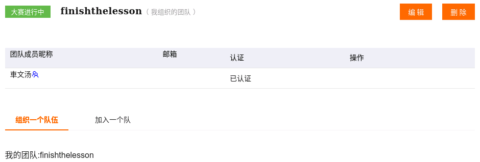

# Ali Tianchi Competition
[【教学赛】金融数据分析赛题1：银行客户认购产品预测](https://tianchi.aliyun.com/competition/entrance/531993/introduction?spm=5176.12281925.0.0.46e67137PjhlEt)

# Data

**To DO: 预测用户是否进行购买产品**

Factors: 

| 字段             | 说明                                                 |
| ---------------- | ---------------------------------------------------- |
| age              | 年龄                                                 |
| job              | 职业：admin, unknown, unemployed, management…        |
| marital          | 婚姻：married, divorced, single                      |
| default          | 信用卡是否有违约: yes or no                          |
| housing          | 是否有房贷: yes or no                                |
| contact          | 联系方式：unknown, telephone, cellular               |
| month            | 上一次联系的月份：jan, feb, mar, …                   |
| day_of_week      | 上一次联系的星期几：mon, tue, wed, thu, fri          |
| duration         | 上一次联系的时长（秒）                               |
| campaign         | 活动期间联系客户的次数                               |
| pdays            | 上一次与客户联系后的间隔天数                         |
| previous         | 在本次营销活动前，与客户联系的次数                   |
| poutcome         | 之前营销活动的结果：unknown, other, failure, success |
| emp_var_rate     | 就业变动率（季度指标）                               |
| cons_price_index | 消费者价格指数（月度指标）                           |
| cons_conf_index  | 消费者信心指数（月度指标）                           |
| lending_rate3m   | 银行同业拆借率 3个月利率（每日指标）                 |
| nr_employed      | 雇员人数（季度指标）                                 |
| subscribe        | 客户是否进行购买：yes 或 no                          |

More details about data for training, testing, and submission are shown in [showdata.ipynb](showdata.ipynb).

## Player

