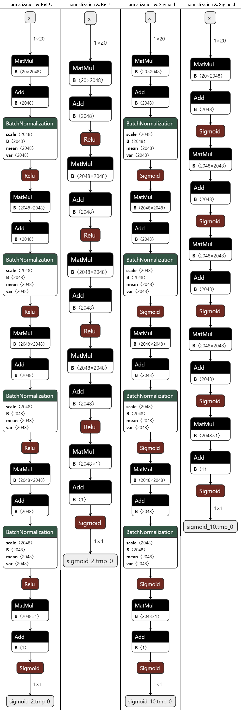
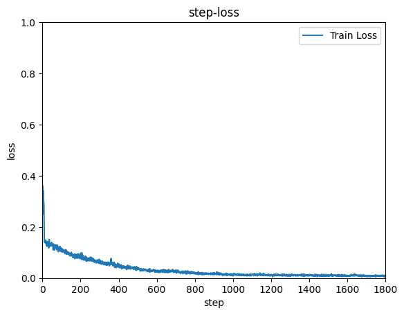
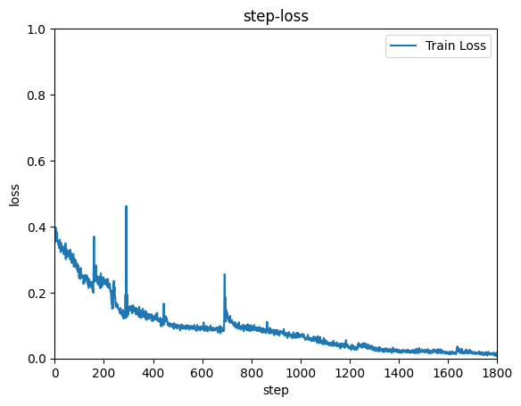
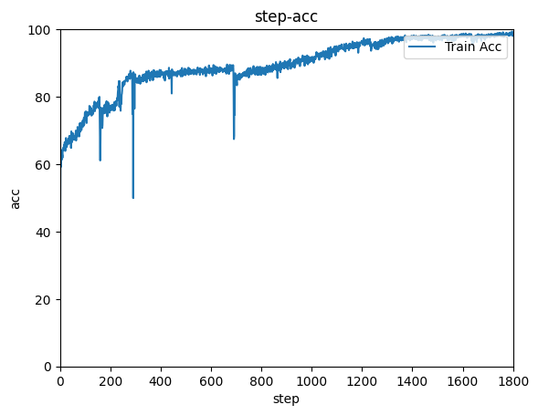
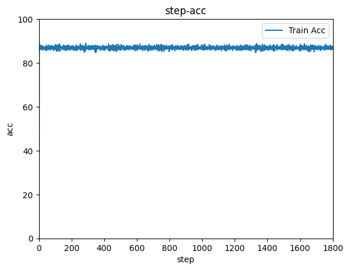

# 阿里天池竞赛
[【教学赛】金融数据分析赛题1：银行客户认购产品预测](https://tianchi.aliyun.com/competition/entrance/531993/introduction?spm=5176.12281925.0.0.46e67137PjhlEt)

# 数据

**To DO: 预测用户是否进行购买产品**

## 数据解释

| 字段             | 说明                                                 |
| ---------------- | ---------------------------------------------------- |
| age              | 年龄                                                 |
| job              | 职业：admin, unknown, unemployed, management…        |
| marital          | 婚姻：married, divorced, single                      |
| education        | 受教育程度                                           |
| default          | 信用卡是否有违约: yes or no                          |
| housing          | 是否有房贷: yes or no                                |
| contact          | 联系方式：unknown, telephone, cellular               |
| month            | 上一次联系的月份：jan, feb, mar, …                   |
| day_of_week      | 上一次联系的星期几：mon, tue, wed, thu, fri          |
| duration         | 上一次联系的时长（秒）                               |
| campaign         | 活动期间联系客户的次数                               |
| pdays            | 上一次与客户联系后的间隔天数                         |
| previous         | 在本次营销活动前，与客户联系的次数                   |
| poutcome         | 之前营销活动的结果：unknown, other, failure, success |
| emp_var_rate     | 就业变动率（季度指标）                               |
| cons_price_index | 消费者价格指数（月度指标）                           |
| cons_conf_index  | 消费者信心指数（月度指标）                           |
| lending_rate3m   | 银行同业拆借率 3个月利率（每日指标）                 |
| nr_employed      | 雇员人数（季度指标）                                 |
| subscribe        | 客户是否进行购买：yes 或 no                          |

## 训练数据

共有22500条记录，每条记录有21个字段（包括subscribe）

| id   | age  | job          | marital  | education           | default | housing | loan | contact  | month | day_of_week | duration | campaign | pdays | previous | poutcome    | emp_var_rate | cons_price_index | cons_conf_index | lending_rate3m | nr_employed | subscribe |
| ---- | ---- | ------------ | -------- | ------------------- | ------- | ------- | ---- | -------- | ----- | ----------- | -------- | -------- | ----- | -------- | ----------- | ------------ | ---------------- | --------------- | -------------- | ----------- | --------- |
| 1    | 51   | admin.       | divorced | professional.course | no      | yes     | yes  | cellular | aug   | mon         | 4621     | 1        | 112   | 2        | failure     | 1.4          | 90.81            | -35.53          | 0.69           | 5219.74     | no        |
| 2    | 50   | services     | married  | high.school         | unknown | yes     | no   | cellular | may   | mon         | 4715     | 1        | 412   | 2        | nonexistent | -1.8         | 96.33            | -40.58          | 4.05           | 4974.79     | yes       |
| 3    | 48   | blue-collar  | divorced | basic.9y            | no      | no      | no   | cellular | apr   | wed         | 171      | 0        | 1027  | 1        | failure     | -1.8         | 96.33            | -44.74          | 1.5            | 5022.61     | no        |
| 4    | 26   | entrepreneur | single   | high.school         | yes     | yes     | yes  | cellular | aug   | fri         | 359      | 26       | 998   | 0        | nonexistent | 1.4          | 97.08            | -35.55          | 5.11           | 5222.87     | yes       |
| 5    | 45   | admin.       | single   | university.degree   | no      | no      | no   | cellular | nov   | tue         | 3178     | 1        | 240   | 4        | success     | -3.4         | 89.82            | -33.83          | 1.17           | 4884.7      | no        |

## 测试数据

共有7500条记录，每条记录有20个字段（去除了subscribe）

| id    | age  | job         | marital | education           | default | housing | loan | contact   | month | day_of_week | duration | campaign | pdays | previous | poutcome    | emp_var_rate | cons_price_index | cons_conf_index | lending_rate3m | nr_employed |
| ----- | ---- | ----------- | ------- | ------------------- | ------- | ------- | ---- | --------- | ----- | ----------- | -------- | -------- | ----- | -------- | ----------- | ------------ | ---------------- | --------------- | -------------- | ----------- |
| 22501 | 35   | technician  | single  | professional.course | no      | yes     | yes  | cellular  | aug   | mon         | 3295     | 1        | 476   | 0        | success     | 1.4          | 95.37            | -33.04          | 3.63           | 5204.54     |
| 22502 | 26   | admin.      | single  | high.school         | no      | yes     | no   | cellular  | may   | thu         | 2872     | 1        | 166   | 2        | success     | -1.8         | 91.75            | -44.42          | 3.16           | 4924.78     |
| 22503 | 44   | blue-collar | married | basic.6y            | no      | no      | no   | telephone | may   | mon         | 268      | 3        | 968   | 0        | nonexistent | 1.1          | 89.67            | -36.9           | 5.04           | 4947.02     |
| 22504 | 36   | blue-collar | married | basic.9y            | no      | yes     | no   | telephone | nov   | thu         | 30       | 1        | 432   | 5        | success     | -0.1         | 89.87            | -41.66          | 3.27           | 5203.33     |
| 22505 | 41   | blue-collar | married | basic.4y            | no      | yes     | no   | telephone | may   | thu         | 1670     | 1        | 944   | 3        | success     | 1.1          | 97.64            | -36.32          | 3.95           | 4992.02     |

## 提交格式

| id    | subscribe |
| ----- | --------- |
| 22501 | no        |
| 22502 | no        |
| 22503 | no        |
| 22504 | no        |
| 22505 | no        |

# 模型结构

全连接神经网络，5层，每层2048节点。可选：ReLU激活函数、batch normlization、onehot编码。

# 结果

MSE & Accuracy during training process. Training settings: batch_size = 2500, epochs = 10.

- Encode strings into a value
  - 1-1 normalization & ReLU
  - 1-2 ~~normalization~~ & ReLU
  - 1-3 normalization & Sigmoid
  - 1-4 ~~normalization~~ & Sigmoid
- Onehot
  - 2-1 normalization & ReLU
  - 2-2 ~~normalization~~ & ReLU
  - 2-3 normalization & Sigmoid
  - 2-3 ~~normalization~~ & Sigmoid

| MSE (1-1 normalization & ReLU) 0.01               | Accuracy (1-1 normalization & ReLU) 98.88%            |
| ------------------------------------------------- | ----------------------------------------------------- |
|            |                 |
| **MSE (1-2 ~~normalization~~ & ReLU) 0.01**       | **Accuracy (1-2 ~~normalization~~ & ReLU) 98.60%**    |
|                 |                      |
| **MSE (1-3 normalization & Sigmoid) 0.07**        | **Accuracy (1-3 normalization & Sigmoid) 91.40%**     |
|         |              |
| **MSE (1-4 ~~normalization~~ & Sigmoid) 0.13**    | **Accuracy (1-4 ~~normalization~~ & Sigmoid) 86.84%** |
|              |                   |
| **MSE 2-1 normalization & ReLU 0.01**             | **Accuracy 2-1 normalization & ReLU 98.84%**          |
|     |          |
| **MSE 2-2 ~~normalization~~ & ReLU 0.13**         | **Accuracy 2-2 ~~normalization~~ & ReLU 87.24%**      |
|          |               |
| **MSE 2-3 normalization & Sigmoid 0.10**          | **Accuracy 2-3 normalization & Sigmoid 94.48%**       |
|  |       |
| **MSE 2-4 ~~normalization~~ & Sigmoid 0.13**      | **Accuracy 2-4 ~~normalization~~ & Sigmoid 86.68%**   |
|       |            |

# **参赛队伍**

**我组件了一支单人队伍，队伍名称是finishtheless**

****